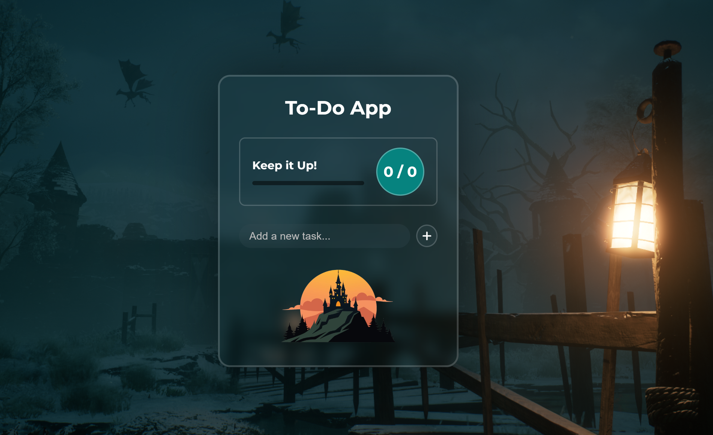

# To-Do List App

A sleek and modern To-Do List web application built with **HTML**, **CSS**, and **JavaScript**. This app allows you to add, edit, complete, and delete tasks with a smooth user experience, progress tracking, and a fun confetti celebration when all tasks are done!

<!-- Add your screenshot here -->

## Features

- Add new tasks quickly via input or button
- Mark tasks as completed with checkboxes
- Edit tasks (only if not completed)
- Delete tasks individually
- Visual progress bar showing completion status
- Numeric display of completed vs total tasks
- Confetti animation when all tasks are completed 🎉
- Persistent storage using `localStorage`
- Responsive design for mobile and desktop
- Empty state image when no tasks are present

## Demo

Try the live demo here: [Your Demo Link] (if hosted online)

## Installation

1. Clone the repository:
git clone https://github.com/Rolling-Thunder07/To-Do-App

2. Navigate to the project folder:
cd todo-list-app

3. Open `index.html` in your favorite browser.

## Usage

- Type your task in the input field and press **Enter** or click the **+** button.
- Click the checkbox to mark a task as completed.
- Click the pencil icon to edit a task (only if not completed).
- Click the trash icon to delete a task.
- Watch the progress bar update dynamically.
- Celebrate with confetti when all tasks are completed!

## Technologies Used

- HTML5
- CSS3 (with Google Fonts and Font Awesome icons)
- JavaScript (ES6+)
- [tsparticles Confetti](https://github.com/matteobruni/tsparticles) for confetti animation

## Folder Structure

todo-list-app/
│
├── images/ # Images used in the app (wallpaper, empty state, etc.)
├── index.html # Main HTML file
├── style.css # Styling for the app
└── script.js # JavaScript logic

## Contributing

Contributions are welcome! Feel free to open issues or submit pull requests.

## License

This project is licensed under the MIT License - see the [LICENSE](LICENSE) file for details.

---
